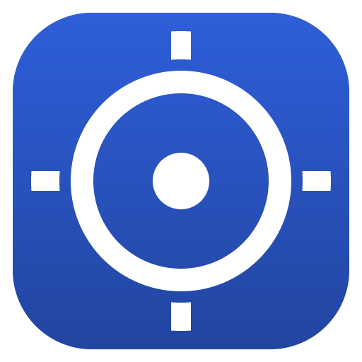

# MyVault

**Offline stock manager for small shops.** Add your products, see what you have,
and never lose track of what is running out — all stored on your own Windows PC.
No account, no subscription, no internet connection.

<!-- markdownlint-disable-next-line MD033 -->


---

## What it does

**Your products**

Every item always has the same four standard details:

| Standard detail | |
| --- | --- |
| **Name** | what the product is called |
| **Price** | what you sell it for |
| **Quantity** | how many you have |
| **Barcode** | scan it or type it |

If your shop needs more than that, press **Add a detail** and create your own —
**Size** for a clothes shop, **Age range** for a toy shop, **Expiry date** for a
mini-market. You can have **up to 5** extra details, and each one can be free
text, a number, a date, a yes/no, or a list you choose from. They appear on every
item and you can search, filter and sort by them.

Optional extras are there when you want them and ignorable when you don't:
category, item code/SKU, cost price, supplier, a per-item low-stock limit and
notes.

**Finding things**

- One search box that looks through **name, barcode and category** at once, or
  narrow it to just one of them
- Search ignores accents and capital letters (`παπουτσι` finds `Παπούτσι`)
- Filter by category, by stock level (in stock / low / out), and by any of your
  own choice-list details
- Sort by name, quantity, price, stock value, category, date added — or by your
  own details — ascending or descending, from the menu or by clicking a column

**Day-to-day work**

- Plus and minus buttons on every row for a quick sale or delivery
- Low-stock and out-of-stock warnings, with your own limit per product
- **Scan a barcode anywhere in the app** and the product comes straight up — USB
  barcode readers work out of the box
- Totals along the top: how many products, how many pieces, what the stock is worth
- Delete with a one-click **Undo**
- Import and export CSV so a list you already keep in Excel comes across in one go

**Making it yours**

- 21 languages (see below)
- Light theme, dark theme, or follow Windows
- Six accent colours, so the app can match your shop
- Comfortable or compact rows — compact fits noticeably more products on screen
- Four text sizes, scaling the whole app for a small till screen or a big monitor

**Your data**

- Everything is in a single file on your computer
- Written safely (a crash mid-save can never corrupt the file) with automatic
  rolling backups
- Backup and restore to a USB stick whenever you like

---

## Languages

MyVault is offered in the twenty most widely spoken languages in the world, plus
Greek. You pick one **on the installer's first screen**, and can change it at any
time in **Settings → Language** — the whole app switches instantly. Until you
choose, MyVault follows the language selected during installation, or your
Windows display language.

Prices, quantities and dates follow the chosen language too, so a German shop
sees `1.234,50` where a British one sees `1,234.50`. **Arabic and Urdu lay the
whole interface out right-to-left.**

**Translated in full** — Arabic, Chinese (Simplified), English, French, German,
Greek, Hindi, Indonesian, Portuguese, Russian, Spanish, Turkish, Vietnamese.

**Offered but still showing English** — Bengali, Chinese (Traditional), Japanese,
Korean, Marathi, Tamil, Telugu, Urdu. These are marked `(English)` in the
language menu rather than pretending to be translated, and the app stays fully
usable in them.

Finishing one is a single file and no code: copy `src/i18n/locales/en.ts` into
`src/i18n/locales/<code>.json`, translate the right-hand side, and leave every
`{placeholder}` in place. `npm test` then checks that the keys and placeholders
all line up. Anything not yet translated falls back to English, so a partly
finished language is safe to ship.

The Windows installer itself speaks 15 of the 21. NSIS, which builds the
installer, ships no translation for Bengali, Urdu, Marathi, Telugu or Tamil, and
the Hindi file it does ship is malformed — it aborts the build outright, so Hindi
is app-only too. Those six appear inside the app, where they work normally, and
the installer falls back to English for them.

---

## Completely offline

Once installed, MyVault never touches the internet. This is enforced, not just
promised:

- Every network request the app could make is **cancelled before it leaves** —
  only MyVault's own files on your disk are ever loaded.
- The parts of the browser engine underneath that normally phone home on their
  own (update checks, safe-browsing lists, crash reports, usage metrics) are
  **switched off before the engine starts**.
- The interface is locked to its own bundled files, so nothing external can be
  pulled in even if it wanted to.
- Camera, microphone and location permissions are refused outright.
- There is no account, no login, no sync and no telephone-home. Nothing about
  your shop is sent anywhere, ever.

The test suite checks this directly: it launches the real app and tries to reach
the network by five different routes, and every one has to fail.

---

## Updating the app

Installing a newer version replaces **the program only** — your inventory is kept
somewhere separate and is never touched by the installer. You do not need to
export anything first.

To update: download the newer installer and run it over the top. Your items,
categories, extra details and every setting stay exactly as they were.

Extra safety on top of that: the first time a new version opens your file, it
takes an untouched copy of it first — `myvault-before-1.0.0-…json` in the backups
folder. If an update ever misbehaves, that copy is the way back. Those snapshots
are never rotated away by routine backups.

The data file carries a version stamp, so a future release knows how to read a
file written by an older one. If an older version is ever asked to open a newer
file, it keeps the original safe rather than overwriting it.

---

## What it costs to run

Nothing, permanently, on the GitHub Free plan.

MyVault is a desktop program, not a website, so there is nothing to deploy to a
server and no monthly bill behind it:

| A web app would need | MyVault needs |
| --- | --- |
| A server running all the time | Nothing — it runs on the shop's own PC |
| A database | One file, on that same PC |
| A domain and hosting | Nothing — you hand over an `.exe` |
| Paying every month, forever | Paying nothing, ever |

Everything it is built from — Electron, React, Vite, electron-builder, NSIS — is
free and open source. See [THIRD-PARTY-NOTICES.md](THIRD-PARTY-NOTICES.md).

The only thing that ever costs money is **optional**: a Windows code-signing
certificate (roughly €200–400 a year) to stop Windows calling the program
"unrecognised" on first run. While you are handing the file to shops yourself it
is not worth buying — [HANDOUT.md](HANDOUT.md) shows the two clicks past the
warning. It becomes worth considering only if you ever distribute widely.

---

## Getting the app

**This repository is private and stays private.** The source, the history, the
build logs and the finished installers are visible only to you. Nothing is
published anywhere, and the app is handed to shops in person.

### Getting an installer to hand out

**On your own Windows PC — free, no limits:**

```bash
npm install
npm run dist:win
```

Both files appear in `release/`. This costs nothing and is the simplest way.

**Or on GitHub**, if you are not at a Windows machine: go to the **Actions** tab,
pick *Build Windows app*, press **Run workflow**, and download the installers
from the run's summary page when it finishes.

| Download | What it is |
| --- | --- |
| `MyVault-windows-installer` | Normal installer. Adds MyVault to the Start menu and desktop. |
| `MyVault-windows-portable` | Single `.exe`. Runs from anywhere, including a USB stick. |

Then copy the `.exe` onto a USB stick, or email it, and give it to the shop.

#### Staying inside the free allowance

A private repository on the GitHub Free plan includes **2,000 runner minutes**
and **500 MB of artifact storage** per month. Both are plenty here, as long as
the Windows build is not left running on every push:

| | Runs on | Costs roughly |
| --- | --- | --- |
| Tests | every push | ~2 Linux minutes |
| Windows build | every push | ~5 Windows minutes, no storage |
| Keeping the installers | only a version tag, or **Run workflow** | ~175 MB for 7 days |

Minutes are the plentiful allowance, so the installer is *built* on every push —
that is what catches a break in the NSIS script, the icon or the licence
encoding, none of which the Linux tests can see. Storage is the scarce one: an
Electron app bundles its whole runtime into each `.exe`, so two builds sitting
around would nearly fill the 500 MB. An ordinary push therefore builds, checks
both `.exe` files exist, and throws them away; only a tag or a manual run keeps
them, for 7 days.

Building locally uses none of this at all.
[HANDOUT.md](HANDOUT.md) is a short bilingual instruction sheet — installing,
the Windows "unrecognised program" warning, and the first few steps — meant to
be passed along with the file.

Windows shows that warning for any program it has not seen before. Getting rid
of it needs a paid code-signing certificate; when you are handing the file to
shops yourself, it is not worth it — the handout explains the two clicks past it.

`npm run dist:win` must run **on Windows** — that is what produces a Windows
executable. You need [Node.js 20 or newer](https://nodejs.org/).

---

## Developing

```bash
npm install
npm run dev        # Vite dev server + Electron with hot reload
npm start          # production build, then run it
npm test           # store, CSV, search, sorting and translation tests
npm run typecheck  # TypeScript, no emit
npm run icon       # regenerate build/icon.ico (needs Python 3; use python3 on Linux/macOS)
```

### Layout

```
electron/          Main process — the only code that touches the disk
  main.js          Window, native menus, file dialogs, IPC handlers
  preload.js       The narrow bridge exposed to the UI as window.myvault
  store.js         The JSON store: validation, atomic writes, backups, CSV import
  offline.js       The rules that keep the app off the network
  csv.js           Dependency-free CSV reader/writer
src/               The user interface (React + TypeScript)
  components/      Screens and widgets
  state/vault.tsx  App state and every action the UI can perform
  lib/             Search, sorting, formatting
  hooks/           Barcode-scanner listener
  i18n/            Languages: en.ts is the source, one JSON per translation
tests/             Plain-Node tests, no framework
build/             App icon, the installer script, and the icon generator
```

The renderer never has access to Node or the file system. It can only call the
fixed list of operations in `electron/preload.js`, and every one of them is
validated in `electron/store.js` before anything is written. React is bundled
into `dist/` at build time, which is why `dependencies` is empty — the packaged
app ships only MyVault's own code.

---

## Where your data lives

| Build | Location |
| --- | --- |
| Installed | `%APPDATA%\MyVault\data\myvault.json` |
| Portable | `MyVault-Data\myvault.json` next to the `.exe` |

**Settings → Open folder** takes you straight there. Dated backups are kept in
the `backups` sub-folder (the last 10, at most one per 12 hours), plus whatever
you save yourself with **Backup**.

If the file is ever unreadable, MyVault will not overwrite it — it moves it aside
into `backups/` and tells you where it went.

---

## Bringing in a list from Excel

Save your sheet as CSV and use **Import CSV**. Commas and semicolons both work.

Only `Name` is required. These column names are understood:

`Name`, `Barcode`, `SKU`, `Category`, `Quantity`, `Price`, `Cost`,
`Low stock threshold`, `Supplier`, `Notes`

**Any other column becomes one of your extra details automatically** — so a
`Size` or `Age range` column comes across without you setting anything up first,
up to the limit of 5. If a sheet has more columns than that, the products are
still imported and MyVault tells you which columns it had to leave out.
Categories that do not exist yet are created. Rows whose barcode matches a
product you already have update that product instead of duplicating it.

Prices may be written either way: `12.50` or `12,50`.

---

## Keyboard shortcuts

| Keys | Action |
| --- | --- |
| `Ctrl` + `N` | Add an item |
| `Ctrl` + `F` | Jump to the search box |
| `Enter` | Save the open item |
| `Esc` | Close the dialog |
| Double-click a row | Edit that item |
| *Scan a barcode* | Find that item, from any screen |

---

## Licence

**MyVault is free to use** — for your own shop, commercially, on as many of your
own computers as you like, for as long as you like.

**All rights are reserved.** It may not be copied, redistributed, resold, forked
or reproduced as another product. Being able to read the source here does not
grant permission to reuse it. The full terms are in [LICENSE](LICENSE), the
installer shows them before installing, and they are summarised inside the app
under **Settings → Licence**.

The open-source components MyVault is built on (Electron, Chromium, Node.js,
React) keep their own licences, which those terms do not — and cannot — restrict.
They are listed in [THIRD-PARTY-NOTICES.md](THIRD-PARTY-NOTICES.md).

Copyright © 2026 Aristotelis Katsigiannis (Αριστοτέλης Ν. Κατσιγιάννης).

The Latin spelling is the one in `package.json`, because that is what Windows
shows as the publisher — and non-ASCII does not survive the trip into the
installer's metadata, where the Greek came out as `???st?t????`. The Greek stays
in `LICENSE`, which the installer renders as UTF-8 and gets right.

> A licence stops people reusing the code *lawfully*; keeping this repository
> private is what stops them seeing it at all. Both are in place. This is a plain
> summary, not legal advice.
